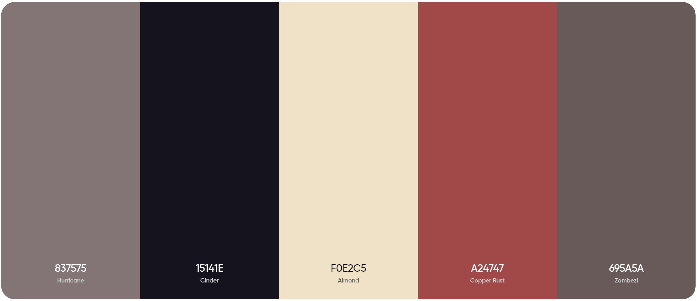

# Styling Rules

This document describes the overall styles and rule sets to follow when defining HTML elements, 
CSS classes, naming conventions for CSS classes, fonts to use, and other styling rules.


## Fonts

Fonts that are being used for the personal website include:
- [Satoshi](https://www.fontshare.com/fonts/satoshi)
- [Stardom](https://www.fontshare.com/fonts/stardom)

## HTML Elements and CSS Classes

Pre-read:
- Use [semantic HTML elements](https://developer.mozilla.org/en-US/docs/Glossary/Semantics#Semantics_in_HTML) Regularly.
- HTML elements should be used for their intended purpose.
- CSS classes should be used for styling purposes.
- Refrain from using `<div>` elements for everything, incorporate the proper tags for each content:
  - `<article>` : For articles, blog posts sections, etc.
  - `<aside>` : For sidebars, call outs, etc.
  - `<details>` : For details that can be toggled on and off.
  - `<figcaption>` : For captions of `<figure>` elements.
  - `<figure>` : For images, illustrations, diagrams, code snippets, etc.
  - `<footer>` : For footers.
  - `<header>` : For headers and navigation.
  - `<main>` : For the main content of the page.
  - `<mark>` : For any highlighted text.
  - `<nav>` : For navigational links or use `<header>` instead.
  - `<section>` : For sections of content containing cards, articles, etc.
  - `<summary>` : For the summary of a `<details>` element.
  - `<time>` : For dates and times.

## Overall Website Appeal

- Use a simple, clean, and consistent design that flows with the original idea.
- Add generous amounts of whitespace to give the website a clean look.
- Use a combination between subtle and striking animations to enhance UX.
- Follow and implement best practices for UI/UX design.

## Color Palette

Referencing colors for each element and class will be done using the following variables,
which will be defined in the `:root` selector in the `global.css` file:

```css global.css
--text: #837575;
--background: #15141e;
--primary: #f0e2c5;
--secondary: #a24747;
--accent: #695a5a;
```
Referencing the colors throughout the document: 

Text: `#837575` <br>
Background: `#15141e` <br>
Primary: `#f0e2c5` <br>
Secondary: `#daaaaa` <br>
Accent: `#695a5a` <br>




**NOTE**: Throughout the document, every element tag with have a hex color associated with it.